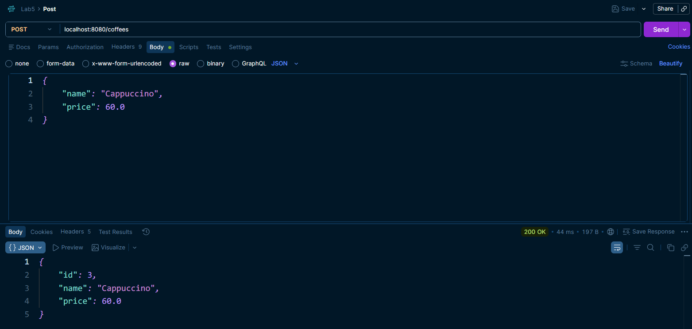
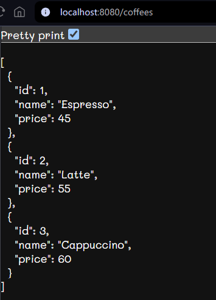

# Lab 5: Coffee Shop REST API

**รายวิชา:** Principles of Software Design

**ผู้จัดทำ:** นายวงศธร ธน.ยอด

**รหัสนักศึกษา:** 673380425-2

**Section:** 4

**มหาวิทยาลัยขอนแก่น คณะวิทยาลัยการคอมพิวเตอร์ สาขาวิทยาการคอมพิวเตอร์**

## เกี่ยวกับโปรเจกต์นี้

โปรเจกต์นี้เป็นการฝึกสร้าง REST API ด้วย Spring Boot ตามโจทย์ที่กำหนด คือทำระบบจัดการเมนูร้านกาแฟ ให้รองรับการเพิ่ม ดู แก้ไข และลบเมนู โดยเน้นการแยกโค้ดเป็น 3 ชั้นตามหลัก Layered Architecture คือ Model, Service และ Controller

จุดที่ตั้งใจทำให้ถูกต้องคือ Controller จะไม่เก็บข้อมูลเอง หน้าที่ของ Controller คือรับ HTTP request แล้วส่งต่อให้ Service จัดการทั้งหมด ส่วน Service เป็นตัวเก็บ logic และข้อมูลจริงในรูปแบบ List อยู่ใน memory

## วิธีรันโปรเจกต์

รันผ่าน Maven ด้วยคำสั่ง

```bash
mvn spring-boot:run
```

อีกทางคือเปิดไฟล์ `Lab5Application.java` ใน IDE แล้วกด Run ปกติ

หลังรันสำเร็จ แอปจะทำงานอยู่ที่ `http://localhost:8080`

## โครงสร้างโค้ด

```
src/main/java/com/example/lab5/
├── Model/
│   └── Coffee.java            เก็บโครงสร้างข้อมูลเมนูกาแฟ
├── Service/
│   └── CoffeeService.java     เก็บ logic และ List ของข้อมูล
├── Controller/
│   └── CoffeeController.java  รับ request แล้วเรียก Service
└── Lab5Application.java
```

## ข้อมูลเริ่มต้น

ตั้งค่าให้มีเมนูตัวอย่างไว้ล่วงหน้า 2 รายการ เพื่อให้ทดสอบ GET ได้ทันทีโดยไม่ต้อง POST ก่อน

| id | name | price |
|----|------|-------|
| 1 | Espresso | 45.0 |
| 2 | Latte | 55.0 |

## Endpoints ทั้งหมด

| Method | Path | ทำอะไร |
|--------|------|--------|
| GET | /coffees | ดูเมนูทั้งหมด |
| GET | /coffees/{id} | ดูเมนู 1 รายการตาม id |
| POST | /coffees | เพิ่มเมนูใหม่ |
| PUT | /coffees/{id} | แก้ไขเมนูตาม id |
| DELETE | /coffees/{id} | ลบเมนูตาม id |

## ตัวอย่างการทดสอบ

ทดสอบด้วย curl หรือ Postman ก็ได้ ตัวอย่างด้านล่างใช้ PostMan

**เพิ่มเมนูใหม่**




ไม่ต้องส่ง id ไปใน body เพราะ Service เป็นคนกำหนด id ให้เองอัตโนมัติ

## หมายเหตุ

ข้อมูลทั้งหมดเก็บอยู่ใน memory เท่านั้น ถ้าปิดแอปหรือ restart ข้อมูลที่เพิ่ม แก้ไข หรือลบไปจะหายและกลับไปเป็นค่าเริ่มต้น 2 รายการเหมือนตอนแรกทุกครั้ง